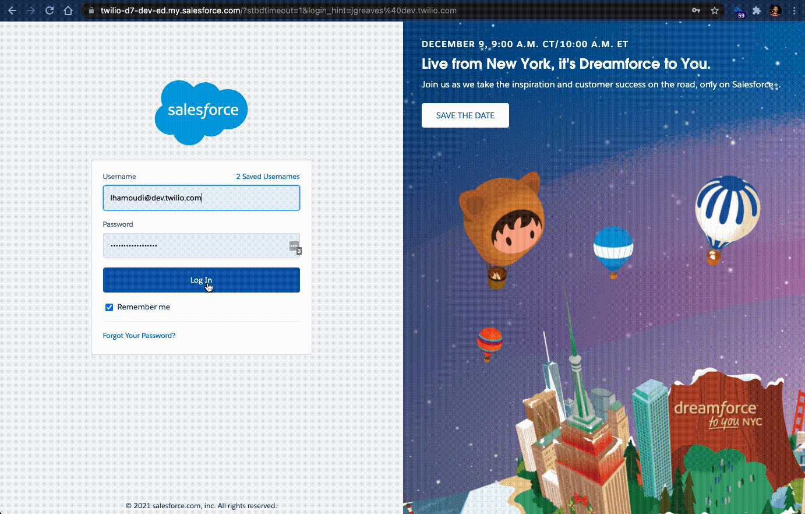
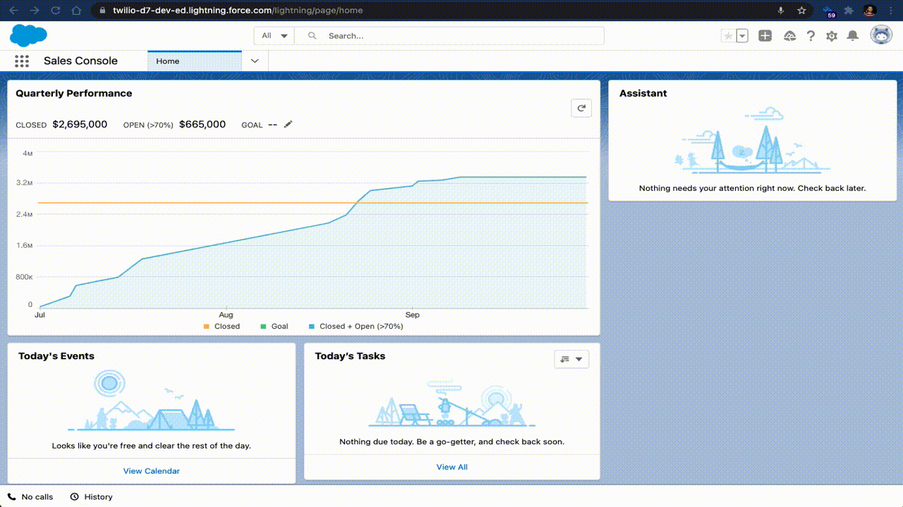
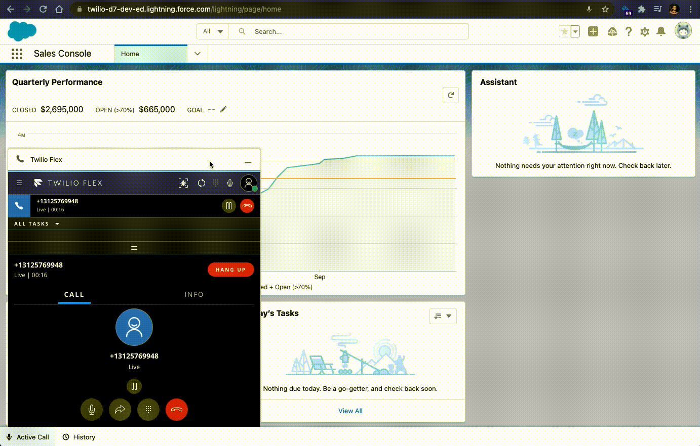

# Salesforce Utility Item Customization Plugin for Flex

## Things it Does

The plugin demonstrates the following capabilities using the Salesforce OpenCTI and Console APIs:

* Pops the Flex Softphone on launching Salesforce
* Dynamically resizes the Flex Softphone during call handling (to reduce Flex footprint when handling calls)
* Pops the Flex Softphone on incoming call
* Dynamically updates the Flex Softphone Utility Item text and icon - during call lifecycle (“Incoming Call”, “Active Call”, “Completed Call”, “No Calls”)
* Disables the Pop-Out feature of the Flex Softphone Utility Item - to prevent active calls from being dropped whenever this happens and the page reloads
  * Note that while the page is loading, there's a small transient period where the plugin is still loading, and so the popout feature can still be accessed then. Low risk, as no active calls.
* Adds a "Refresh Salesforce" button to the header of the Flex Softphone - to reload the current view in Salesforce (without needing to perform a full page refresh and risk call disconnection)

In addition, the plugin demonstrates the following Flex UI customizations

* Displays CRM panel whenever agent is not handling calls
  * CRM panel is customized with a mock agent-level dashboard 
  * Thinking here is that one day we might have the agent stats pulling from OOTB Twilio Sync indexes
* Hides the CRM panel on the right whenever a task is accepted (to free up real estate for call handling)
* Registers an `onbeforeunload` listener to prevent refresh during an active call
  * Listener is added upon accepting the call, and removed upon disconnecting
  * The verbiage of the prompt is not configurable

## Screenshots/Demos

Pop the Flex Softphone on Launching Salesforce


Dynamically Resize the Flex Softphone (and Display Righthand Panel When Idle)


Pop the Flex Softphone on Incoming Call


Dynamically Update Flex Softphone Utility Item Label and Icon


Disable Pop-Out of Flex Softphone Utility Item


Button to Refresh Salesforce UI from Flex Softphone
  

## About Twilio Flex Plugins

Twilio Flex Plugins allow you to customize the appearance and behavior of [Twilio Flex](https://www.twilio.com/flex). If you want to learn more about the capabilities and how to use the API, check out our [Flex documentation](https://www.twilio.com/docs/flex).

## Setup

Make sure you have [Node.js](https://nodejs.org) as well as [`npm`](https://npmjs.com). We support Node >= 10.12 (and recommend the _even_ versions of Node). Afterwards, install the dependencies by running `npm install`:

```bash
cd 

# If you use npm
npm install
```

Next, please install the [Twilio CLI](https://www.twilio.com/docs/twilio-cli/quickstart) by running:

```bash
brew tap twilio/brew && brew install twilio
```

Finally, install the [Flex Plugin extension](https://github.com/twilio-labs/plugin-flex) for the Twilio CLI:

```bash
twilio plugins:install @twilio-labs/plugin-flex
```

## Development

Best to just deploy this - as you can't easily test in Saleforce with a locally running plugin

## Deploy

When you are ready to deploy your plugin, in your terminal run:
```
Run: 
twilio flex:plugins:deploy --major --changelog "Notes for this version" --description "Functionality of the plugin"
```
For more details on deploying your plugin, refer to the [deploying your plugin guide](https://www.twilio.com/docs/flex/plugins#deploying-your-plugin).


